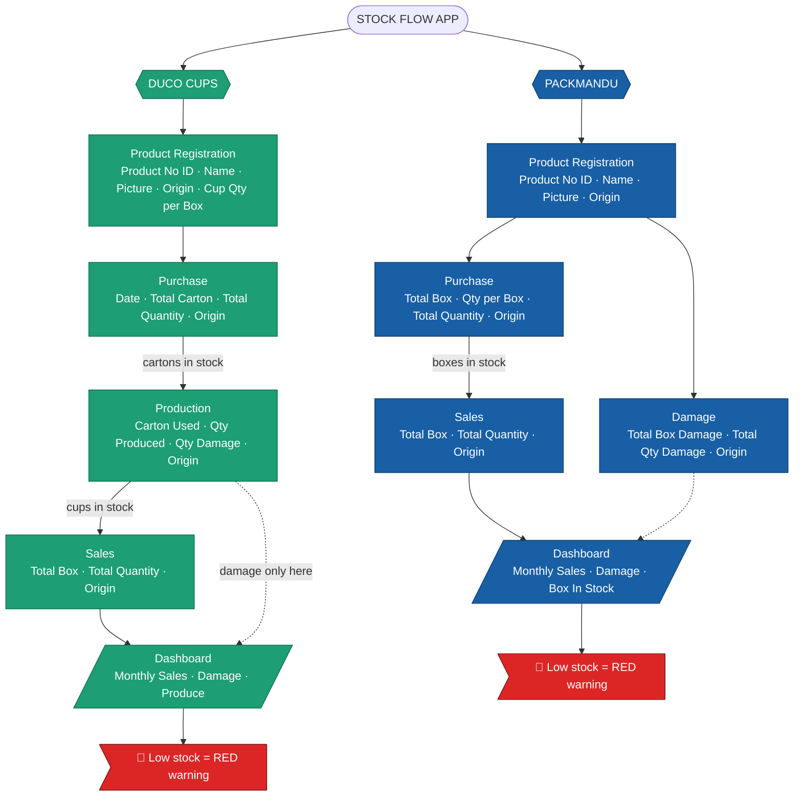

# Stock Flow — Data Model (Client Confirmation)

This document lays out **what data we store** and **how stock, sales, damage, and dashboard numbers are calculated** for both companies. Please review and confirm each section is correct.

> **Confirmed decisions (2026-07-28):**
> - **Product ID = Product No** — the Product Number is the unique identifier for every product.
> - **Country of Origin** is stored on **every** record (registration + all transactions).
> - **Duco Product Registration** includes **Cup Quantity per Box**.
> - **Duco damage** is recorded **only in Production**.
> - **Packmandu** has its own **Damage** section.
> - **Low stock** is shown with a **red warning** in the UI.

---

## 🧭 Mindmap Overview

```
STOCK FLOW APP
│
├── DUCO CUPS  (brand: green)
│   │
│   ├── 1. Product Registration   ← master list of products
│   │      • Product No  ⭐ (= Product ID, unique)
│   │      • Product Name
│   │      • Product Picture
│   │      • Country of Origin
│   │      • Cup Quantity per Box
│   │
│   ├── 2. Purchase               ← raw cartons bought
│   │      • Date
│   │      • Product (No / Name / Picture / Origin)
│   │      • Total Carton
│   │      • Total Quantity
│   │
│   ├── 3. Production             ← cartons turned into finished cups
│   │      • Date
│   │      • Product (No / Name / Picture / Origin)
│   │      • Total Carton Used
│   │      • Total Quantity Produced
│   │      • Total Quantity Damage   ← damage lives ONLY here
│   │
│   └── 4. Sales                  ← finished cups sold
│          • Date
│          • Product (No / Name / Picture / Origin)
│          • Total Box Sales
│          • Total Quantity Sales
│
│      →  Dashboard: monthly Sales / Damage / Produce per product
│      →  🔴 Low stock shown as RED warning
│
└── PACKMANDU  (brand: blue)
    │
    ├── 1. Product Registration   ← master list of products
    │      • Product No  ⭐ (= Product ID, unique)
    │      • Product Name
    │      • Product Picture
    │      • Country of Origin
    │
    ├── 2. Purchase               ← boxes bought
    │      • Date
    │      • Product (No / Name / Picture / Origin)
    │      • Total Box Purchase
    │      • Total Quantity Per Box
    │      • Total Quantity Purchase
    │
    ├── 3. Sales                  ← boxes sold
    │      • Date
    │      • Product (No / Name / Picture / Origin)
    │      • Total Box Sales
    │      • Total Quantity Sales
    │
    └── 4. Damage                 ← boxes/quantity damaged
           • Date
           • Product (No / Name / Picture / Origin)
           • Total Box Damage
           • Total Quantity Damage

       →  Dashboard: monthly Sales / Damage + Box In Stock per product
       →  🔴 Low stock shown as RED warning
```

---

## 🗺️ Mermaid Flowchart



---

## 🧮 Formulas

### DUCO CUPS

**Product flow:** Purchase (cartons) → Production (cartons → cups, some damaged) → Sales (cups sold)

| # | Metric | Formula |
|---|---|---|
| 1 | Cartons in stock | `Total Carton Purchased − Total Carton Used (in production)` |
| 2 | Cups in stock (net) | `Total Quantity Produced − Total Quantity Sales − Total Quantity Damage` |
| 3 | Monthly Sales (per product) | `SUM(Total Quantity Sales) for the month` |
| 4 | Monthly Damage (per product) | `SUM(Total Quantity Damage) for the month` |
| 5 | Monthly Produce (per product) | `SUM(Total Quantity Produced) for the month` |
| 6 | Cups per Box (reference) | from Product Registration → `Cup Quantity per Box` |
| 7 | 🔴 Low stock warning | `Cups in stock ≤ 0` → row highlighted **RED** |

> ✅ **Confirmed:** Duco damage is recorded **only in Production** — there is no damage field on Sales.

### PACKMANDU

**Product flow:** Purchase (boxes) → Sales (boxes sold) → Damage (logged separately).

| # | Metric | Formula |
|---|---|---|
| 1 | Box In Stock | `Total Box Purchase − Total Box Sales − Total Box Damage` |
| 2 | Quantity in stock | `Total Quantity Purchase − Total Quantity Sales − Total Quantity Damage` |
| 3 | Total Quantity Purchase | `Total Box Purchase × Total Quantity Per Box` |
| 4 | Monthly Sales (per product) | `SUM(Total Quantity Sales) for the month` |
| 5 | Monthly Damage (per product) | `SUM(Total Quantity Damage) for the month` |
| 6 | 🔴 Low stock warning | `Box In Stock ≤ 0` → row highlighted **RED** |

> ✅ **Confirmed:** Packmandu has its own **Damage** section (Total Box Damage + Total Quantity Damage), which feeds the Dashboard's monthly damage total.

---

## ✅ Confirmed Decisions

1. **Product ID** — the **Product No** is the unique product identifier (Product ID) across the whole app.
2. **Product Registration** — a real master list; products are created once and reused (auto-filled) in Purchase / Production / Sales / Damage.
3. **Country of Origin** — stored on **every** record (registration and all transactions).
4. **Duco – Cup Quantity per Box** — added to Duco Product Registration.
5. **Duco Damage** — recorded **only in Production**.
6. **Packmandu Damage** — has its own dedicated section (box + quantity).
7. **Low stock** — displayed as a **🔴 red warning** in the UI when stock is at/below zero.

## ❓ Still Open

1. **Duco "Total Box Sales"** — Duco tracks cups by quantity; confirm what "box" means at Sales and whether it derives from *Cup Quantity per Box*. yes
2. **Block vs. warn** — should a sale that pushes stock below zero be **blocked**, or only **warned** (red) and allowed? *(Recommended: warn + allow.)* warn
