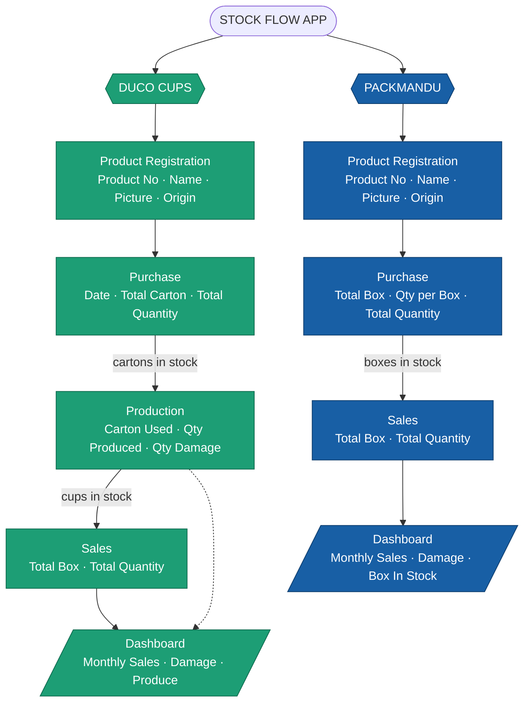

# Stock Flow — Data Model (Client Confirmation)

This document lays out **what data we store** and **how stock, sales, damage, and dashboard numbers are calculated** for both companies. Please review and confirm each section is correct.

---

## 🧭 Mindmap Overview

```
STOCK FLOW APP
│
├── DUCO CUPS  (brand: green)
│   │
│   ├── 1. Product Registration   ← master list of products
│   │      • Product No
│   │      • Product Name
│   │      • Product Picture
│   │      • Country of Origin
│   │
│   ├── 2. Purchase               ← raw cartons bought
│   │      • Date
│   │      • Product (No / Name / Picture / Origin)
│   │      • Total Carton
│   │      • Total Quantity
│   │
│   ├── 3. Production             ← cartons turned into finished cups
│   │      • Date
│   │      • Product (No / Name / Picture / Origin)
│   │      • Total Carton Used
│   │      • Total Quantity Produced
│   │      • Total Quantity Damage
│   │
│   └── 4. Sales                  ← finished cups sold
│          • Date
│          • Product (No / Name / Picture / Origin)
│          • Total Box Sales
│          • Total Quantity Sales
│
│      →  Dashboard: monthly Sales / Damage / Produce per product
│
└── PACKMANDU  (brand: blue)
    │
    ├── 1. Product Registration   ← master list of products
    │      • Product No
    │      • Product Name
    │      • Product Picture
    │      • Country of Origin
    │
    ├── 2. Purchase               ← boxes bought
    │      • Date
    │      • Product (No / Name / Picture / Origin)
    │      • Total Box Purchase
    │      • Total Quantity Per Box
    │      • Total Quantity Purchase
    │
    └── 3. Sales                  ← boxes sold
           • Date
           • Product (No / Name / Picture / Origin)
           • Total Box Sales
           • Total Quantity Sales

       →  Dashboard: monthly Sales / Damage + Box In Stock per product
```

---

## 🗺️ Mermaid Flowchart



> **How to view:** GitHub, VS Code (with a Mermaid extension), and most Markdown previewers render this automatically. You can also paste it into <https://mermaid.live> to export a PNG for the client.

---

## 🧮 Formulas

### DUCO CUPS

**Product flow:** Purchase (cartons) → Production (cartons → cups, some damaged) → Sales (cups sold)

| # | Metric | Formula |
|---|---|---|
| 1 | Cartons in stock | `Total Carton Purchased − Total Carton Used (in production)` |
| 2 | Cups in stock (net) | `Total Quantity Produced − Total Quantity Sales − Total Quantity Damage` |
| 3 | Monthly Sales (per product) | `SUM(Total Quantity Sales) for the month` |
| 4 | Monthly Damage (per product) | `SUM(Total Quantity Damage) for the month` |
| 5 | Monthly Produce (per product) | `SUM(Total Quantity Produced) for the month` |
| 6 | Low stock warning | `Cups in stock ≤ 0` |

> ❓ **Confirm:** Where does "damage" happen for Duco — only during **Production**, or also at **Sales** time?

### PACKMANDU

**Product flow:** Purchase (boxes) → Sales (boxes sold). No production step.

| # | Metric | Formula |
|---|---|---|
| 1 | Box In Stock | `Total Box Purchase − Total Box Sales` |
| 2 | Quantity in stock | `Total Quantity Purchase − Total Quantity Sales` |
| 3 | Total Quantity Purchase | `Total Box Purchase × Total Quantity Per Box` |
| 4 | Monthly Sales (per product) | `SUM(Total Quantity Sales) for the month` |
| 5 | Monthly Damage (per product) | `SUM(Damage) for the month` |
| 6 | Low stock warning | `Box In Stock ≤ 0` |

> ❓ **Confirm:** Packmandu Sales currently has no **Damage** field, but the Dashboard shows "Product Total Damage (Monthly)." Where is damage recorded for Packmandu?

---

## ✅ Questions to Confirm With Client

1. **Product Registration** — is this a real master list where products are created once, then reused (auto-filled) in Purchase/Production/Sales? *(Recommended — avoids re-typing product details.)*
2. **Country of Origin** — should this appear on **every** transaction, or only on Product Registration and inherited automatically?
3. **Duco Damage** — recorded at Production only, or also at Sales?
4. **Packmandu Damage** — where is it entered, since Sales has no damage field today?
5. **Duco "Total Box Sales"** — Duco produces cups by quantity; what does "box" mean here vs. quantity? How many cups per box?
6. **Stock alerts** — should the app warn/block a sale when it would push stock below zero? *(Recommended: warn.)*
